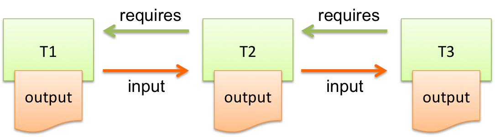

=============================
Getting Started with Luigi-TD
=============================

This tutorial will walk you through installing and configuring Luigi-TD, as well how to use it to write your first data pipiline.

This tutorial assumes you are familiar with Python and that you have registered for a `Treasure Data <http://www.treasuredata.com>`_ account.  You'll need retrieve your API key from the web-based console.

Installation
============

You can use ``pip`` to install the latest released version of Luigi-TD::

  $ pip install luigi-td

Configuration
=============

You can set your API key as an environment variable ``TD_API_KEY``::

  $ export TD_API_KEY=1/1c410625...

Alternatively, you can use the Luigi configuration file (``/etc/luigi/client.cfg`` by default)::

  # configuration for Luigi
  [core]
  error-email: you@example.com

  # configuration for Luigi-TD
  [td]
  apikey: 1/1c410625...
  endpoint: https://api.treasuredata.com

Running Queries
===============

.. note::

  The full scripts in this tutorial are available online at http://github.com/k24d/luigi-td/example/tutorial/tasks.py

A query is defined as a subclass of ``Query``::

  import luigi
  import luigi_td as td

  class MyQuery(luigi_td.Query):
      type = 'presto'
      database = 'sample_datasets'

      def query(self):
          return "SELECT count(1) cnt FROM www_access"

  if __name__ == '__main__':
      luigi.run()

You can submit your query as a normal Python script as follows::

  $ python tasks.py MyQuery --local-scheduler
  DEBUG: Checking if MyQuery() is complete
  /usr/local/lib/python2.7/site-packages/luigi/task.py:433: UserWarning: Task MyQuery() without outputs has no custom complete() method
    warnings.warn("Task %r without outputs has no custom complete() method" % self)
  INFO: Scheduled MyQuery() (PENDING)
  INFO: Done scheduling tasks
  INFO: Running Worker with 1 processes
  DEBUG: Asking scheduler for work...
  DEBUG: Pending tasks: 1
  INFO: [pid 1234] Worker Worker(salt=123456789, host=...) running   MyQuery()
  INFO: MyQuery(): td.job_url: https://console.treasuredata.com/jobs/19958264
  INFO: MyQuery(): td.job_result: id=19958264 status=success
  INFO: [pid 1234] Worker Worker(salt=123456789, host=...) done      MyQuery()

You will find INFO messages "td.job_url" and "td.job_result" in the log.  The result of your query is accessible by opening the URL with your favorite browser.

Getting Results
===============

You will want to retrieve query results within Python for further processing.  A straight forward way of doing that is to overwrite the ``run`` method and call ``run_query`` in it::

  class MyQueryRun(luigi_td.Query):
      type = 'presto'
      database = 'sample_datasets'

      def query(self):
          return "SELECT count(1) cnt FROM www_access"

      def run(self):
          result = self.run_query(self.query())
          print '===================='
          print "Job ID     :", result.job_id
          print "Result size:", result.size
          print "Result     :"
          print "\t".join([c[0] for c in result.description])
          print "----"
          for row in result:
              print "\t".join([str(c) for c in row])
          print '===================='

The result of ``run_query`` is an instance of ``ResultProxy`` and you can fetch rows immediately::

  $ python tasks.py MyQueryRun --local-scheduler
  ...
  INFO: [pid 1234] Worker Worker(salt=123456789, host=...) running   MyQueryRun()
  INFO: MyQuery(): td.job_url: https://console.treasuredata.com/jobs/19958264
  INFO: MyQuery(): td.job_result: id=19958264 status=success
  ====================
  Job ID     : 19958264
  Result size: 24
  Result     :
  cnt
  ----
  5000
  ====================
  INFO: [pid 1234] Worker Worker(salt=123456789, host=...) done      MyQueryResult()

In practice, however, you should save the result before processing it when building a data pipeline with Luigi.  As you are working with big data, running a query could take a long time and retrieving the result over network might be very slow.  You should create a local copy of your result and work with it.

The ``output`` method can be defined in the same way as you write regular Luigi tasks.  For example, you can use ``luigi.LocalTarget``, combined with ``to_csv``, to save the result to a local file::

  class MyQuerySave(luigi_td.Query):
      type = 'presto'
      database = 'sample_datasets'

      def query(self):
          return "SELECT count(1) cnt FROM www_access"

      def output(self):
          return luigi.LocalTarget('MyQuerySave.csv')

      def run(self):
          result = self.run_query(self.query())
          result.to_csv(self.output().path)

Building Pipelines
==================

A "data pipeline" is a series of tasks, passing the result of one task to another.

It is always recommended for you to define queries as pipelines.  You can split your query into 3 steps:

1. Running a query
2. Retrieving the result
3. Processing the result

Each step could consume considerable resources (i.e., cpu time, network bandwidth, etc.) and you should avoid repeating the same process.  If you had a bug in step 3, and you didn't save the result in step 2, you would run the same query and download the result again and again until you fixed the bug successfully.

Unless your query is adequately small, you should save "the state of a job" without waiting for the result and then run a different task that retrieves the result.  This is the default behavior of ``Query`` and you can use ``ResultTarget``, instead of ``LocalTarget``, to save the state::

  class MyQueryStep1(luigi_td.Query):
      type = 'presto'
      database = 'sample_datasets'

      def query(self):
          return "SELECT count(1) cnt FROM www_access"

      def output(self):
          # the state of a query is saved as ResultTarget
          return luigi_td.ResultTarget('MyQueryStep1.job')

  class MyQueryStep2(luigi.Task):
      def requires(self):
          return MyQueryStep1()

      def output(self):
          return luigi.LocalTarget('MyQueryStep2.csv')

      def run(self):
          result = self.input()
          # retrieve the result and save it as a local CSV file
          result.to_csv(self.output().path)

  class MyQueryStep3(luigi.Task):
      def requires(self):
          return MyQueryStep2()

      def output(self):
          return luigi.LocalTarget('MyQueryStep3.csv')

      def run(self):
          with self.input().open() as f:
              # process the result here
              print f.read()
          with self.output().open('w') as f:
              # crate the final output
              f.write('done')

As you see in this example, the preceding tasks are required by the following tasks.  Luigi's scheduler resolves the dependency and all tasks are executed one after another just by running the last one::

  $ python tasks.py MyQueryStep3 --local-scheduler
  ...
  INFO: [pid 1234] Worker Worker(salt=123456789, host=...) running   MyQueryStep1()
  INFO: MyQuery(): td.job_url: https://console.treasuredata.com/jobs/19958264
  INFO: MyQuery(): td.job_result: id=19958264 status=success
  INFO: [pid 1234] Worker Worker(salt=123456789, host=...) done      MyQueryStep1()
  ...
  INFO: [pid 1234] Worker Worker(salt=123456789, host=...) running   MyQueryStep2()
  INFO: [pid 1234] Worker Worker(salt=123456789, host=...) done      MyQueryStep2()
  ...
  INFO: [pid 1234] Worker Worker(salt=123456789, host=...) running   MyQueryStep3()
  cnt
  5000

  INFO: [pid 1234] Worker Worker(salt=123456789, host=...) done      MyQueryStep3()

This looks complex at the first glance, but you will eventually find it being a natural way of building data pipilines with Luigi.  Every single task should define an explicit ``output`` method to avoid repeated execution of the same task.

Templating Queries
==================

Luigi-TD uses `Jinja2 <http://jinja.pocoo.org/>`_ as the default template engine.  You can write your query in an external file and set ``source`` to the file::

  class MyQueryFromTemplate(luigi_td.Query):
      type = 'presto'
      database = 'sample_datasets'
      source = 'templates/query_with_status_code.sql'

      # variables used in the template
      status_code = 200

::

  -- templates/query_with_status_code.sql
  SELECT count(1) cnt
  FROM   www_access
  WHERE  code = {{ task.status_code }}

As you see in this example, a single variable ``task`` is available in templates.  The value of ``task`` is the instance of your query.  As a result, ``{{ task.status_code }}`` is replaced by ``200`` at run time.  You can define any variables or methods in your class and access to them through ``task``.

If you prefer setting variables explicitly, use ``variables`` instead::

  class MyQueryWithVariables(luigi_td.Query):
      type = 'presto'
      database = 'sample_datasets'
      source = 'templates/query_with_variables.sql'

      # define variables
      variables = {
          'status_code': 200,
      }

      # use property for dynamic variables
      # @property
      # def variables(self):
      #     return {
      #         'status_code': 200,
      #     }

::

  -- templates/query_with_variables.sql
  SELECT count(1) cnt
  FROM   www_access
  WHERE  code = {{ status_code }}

Passing Parameters
==================

Luigi supports passing parameters as command line options or constructor arguments.  This is convenient for building queries dynamically::

  class MyQueryWithParameters(luigi_td.Query):
      type = 'presto'
      database = 'sample_datasets'
      source = 'templates/query_with_time_range.sql'

      # parameters
      year = luigi.IntParameter()

::

  -- templates/query_with_time_range.sql
  SELECT
    td_time_format(time, 'yyyy-MM') month,
    count(1) cnt
  FROM
    nasdaq
  WHERE
    td_time_range(time, '{{ task.year }}-01-01', '{{ task.year + 1 }}-01-01')
  GROUP BY
    td_time_format(time, 'yyyy-MM')

In this case, a parameter ``year`` is defined as an integer.  You can set it by a command line option as follows::

  $ python tasks.py MyQueryWithParameters --local-scheduler --year 2010
  INFO: Scheduled MyQueryWithParameters(year=2010) (PENDING)
  ...

The query template is rendered using parameters.  You will get the following query as a result::

  -- templates/query_with_time_range.sql
  SELECT
    td_time_format(time, 'yyyy-MM') month,
    count(1) cnt
  FROM
    nasdaq
  WHERE
    td_time_range(time, '2010-01-01', '2011-01-01')
  GROUP BY
    td_time_format(time, 'yyyy-MM')

Parameters are also useful to create unique names in ``output``.  You will often run the same query repeatedly with different paramters.  You have to create different names for all query submissions::

  class MyQueryWithParameters(luigi_td.Query):
      type = 'presto'
      database = 'sample_datasets'
      source = 'templates/query_with_time_range.sql'

      # parameters
      year = luigi.IntParameter()

      def output(self):
          return luigi_td.ResultTarget('MyQueryWithParameters-{0}.job'.format(self.year))

Now you are ready to automate the process of running multiple queries with different parameters.  You can set up scheduled invocation for your tasks, or write an aggregation task that invokes your parameterized tasks as much as you want::

  class MyQueryAggregator(luigi.Task):
      def requires(self):
          # create a list of tasks with different parameters
          return [
              MyQueryWithParameters(2010),
              MyQueryWithParameters(2011),
              MyQueryWithParameters(2012),
              MyQueryWithParameters(2013),
          ]

      def output(self):
          return luigi.LocalTarget('MyQueryAggretator.txt')

      def run(self):
          with self.output().open('w') as f:
              # repeat for each ResultTarget
              for target in self.input():
                  # output results into a single file
                  for row in target.result:
                      f.write(str(row) + "\n")
